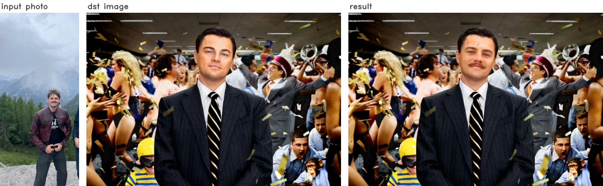

# Avatar processing

A small Python face-swap microservice: it takes a user's photo, cuts the face out of it and
warps it onto a fixed destination picture (Leonardo DiCaprio from The Wolf of Wall Street by
default), producing a silly avatar in WebP.



Written as a standalone service for a pet project - the main app just POSTs a photo and gets
a ready avatar back. That project is dead and its repository is gone; this service was my
part of it, so I pulled it out and published it on its own. No neural network training and
no generative models involved: it is MediaPipe landmarks plus classic OpenCV image
processing, so it runs on CPU in well under a second per image.

Ships with two entry points - a local batch script for experimenting and a FastAPI service.

## Requirements

Python 3.11.

```bash
pip install -r requirements.txt
```

Models are already in `app/models/`, nothing to download.

## Usage

### Local module

Put your images into `app/local_images/in` (a few photos of my friend are already there as
examples) and run from the repo root:

```bash
python -m app.main_local
```

Results land in `app/local_images/out` as WebP.

Arguments:
- `-debug_mode` - also dump every intermediate stage of the pipeline into `app/local_images/tmp`. (default: false)
- `-webp_quality` - WebP quality level, 1-100. (default: 80)
- `-dst_name` - which destination image to warp faces onto. (default: `dicaprio`)

### FastAPI module

Run from the repo root:

```bash
uvicorn app.main_fastapi:app --host 127.0.0.1 --port 8000
```

Models and every destination image are prepared once at startup, so the first request is as
fast as the rest.

- `POST /` - multipart form: `user_id` (str), `img_file` (png/jpeg/webp), optional
  `dst_name` (str, default `dicaprio`) and `webp_quality` (int 1-100, default 80).
  Returns `{"user_id": ..., "path": ...}`.
- `GET /{path}` - returns the resulting WebP.

Uploads are kept in `app/fastapi_images/uploads`, results in `app/fastapi_images/results`.
Interactive docs: http://127.0.0.1:8000/docs

## How it works

Every destination image is processed once at startup (landmarks, mesh triangles, face masks),
so a request only has to deal with the incoming photo.

1. A cheap **FaceDetector** finds the face bounding box. If there is no face, or more than
   one, the image is rejected right away without paying for the expensive model.
2. The box is expanded (with extra room on top, so the forehead is included), cropped and
   resized to 512px wide.
3. **FaceLandmarker** runs on that crop and returns 478 landmarks.
4. Landmarks are turned into a triangle mesh. MediaPipe only ships a list of *edges*, so at
   startup the triangles are derived from the edge adjacency graph - plus a handful of
   hand-written connections that close the holes MediaPipe leaves in the eyes and the inner
   lips, so the mask ends up being a solid face.
5. The mesh mask is eroded a bit - landmark positions on the very border are the least
   precise, and this trims background pixels that would otherwise leak in.
6. The face is warped triangle by triangle: for every source/destination triangle pair an
   affine transform is computed and applied to that patch only.
7. Erosion from step 5 leaves a gap along the face contour. It is filled with the nearest
   valid pixels (a BFS-ish flood outwards from the known area) and then blurred, so the
   filler blends in instead of looking like smeared streaks.
8. Colors are matched to the destination image - first in LAB space (strong on luminance,
   soft on chroma, so skin tone shifts but the picture does not turn into a color wash),
   then a plain mean/std match in RGB.
9. The face is pasted in with `cv2.seamlessClone()`, and the oval contour gets one more soft
   alpha blend on top to kill the remaining seam.

With `-debug_mode` all eleven stages are written out as separate images, which is by far the
easiest way to see what each step actually does.

MediaPipe detectors are not thread-safe, so each one is wrapped in a lock - concurrent
requests queue up on detection but everything else runs in parallel.

### Destination images

Anything dropped into `app/dst_images/` becomes available by its file name; three presets
ship with the repo (`dicaprio`, `mr_house`, `wii`). Pick one with `-dst_name` locally or with
the `dst_name` form field over HTTP.

### Models

- **FaceDetector**: [blaze_face_full_range_sparse.tflite](https://ai.google.dev/edge/mediapipe/solutions/vision/face_detector/index#models) - the full-range variant, it copes best with faces that are small or off-center.
- **FaceLandmarker**: [face_landmarker_v2_with_blendshapes.task](https://ai.google.dev/edge/mediapipe/solutions/vision/face_landmarker/index#models) - the only model available for this task.

## License

[MIT](LICENSE).
